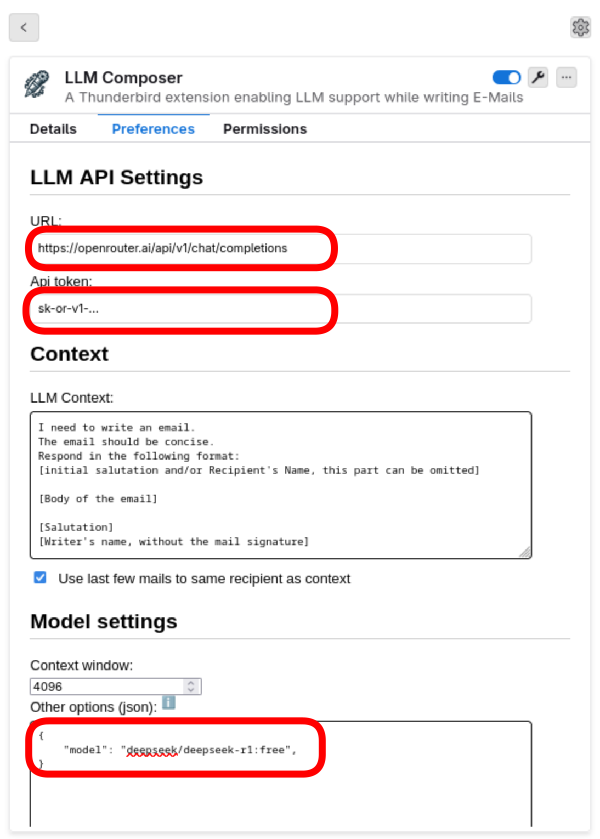

# LLM powered E-Mail writing in Thunderbird

A Thunderbird extension enabling LLM support while writing E-Mails.

## Requirements

- Thunderbird >= 110.0

## Supported LLM Backends

The plugin works with any OpenAI-compatible API endpoint. This includes:

- Hosted providers (e.g. OpenAI, Mistral, …)
- **Locally running models**, e.g. via [LM Studio](https://lmstudio.ai/)

> 💡 **Tip:** You don't have to run the LLM on the same machine you write your emails on.
> For example, you can run LM Studio on a powerful gaming PC to leverage its GPU, and connect
> to it from any other device on your local network — just set the URL in the plugin preferences
> to point to that machine.

## Install the Plugin

- Download the latest release (the `*.xpi` file) from the [release page](https://github.com/TNG/thunderbird-llm-composer/releases)
- Start Thunderbird.
- Go to Hamburger Menu -> Add-ons and Themes.
- Click on the settings symbol -> Install Add-ons from file
- Select the downloaded xpi file

## Configure plugin

Open the preference window of the plugin.
Specify the following things:

- URL: The URL to the endpoint of the LLM.
- Api token: Leave empty if public, otherwise obtain one.
- Optionally: Set a model in "Other options" if the api allows it

### Shortcuts

By default, the plugin, introduces the following shortcuts:
- `Ctrl+Alt+L`: to ask the LLM to compose a mail
- `Ctrl+Alt+K`: to ask the LLM to summarize the existing conversation
- `Ctrl+Alt+C`: to cancel an ongoing LLM request

Shortcuts can be customized in
"Add-ons Manger" >> Settings ⚙ >> "Manage Extension Shortcuts"

## Contributing

See [Contributing](docs/CONTRIBUTING.md)

## License

This project is licensed under the Apache License 2.0. See the [LICENSE](LICENSE) file for details.
